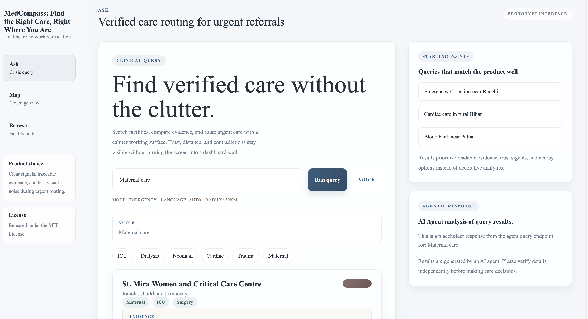
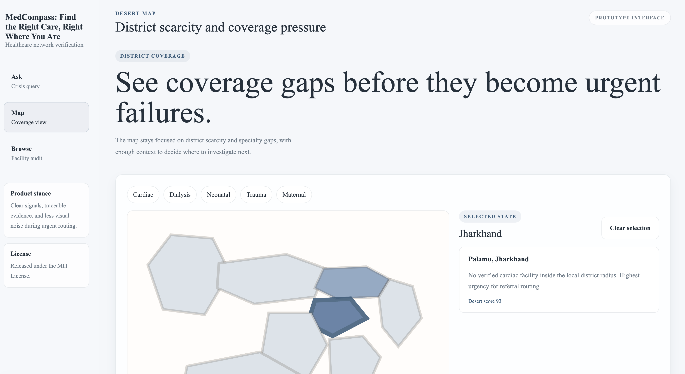
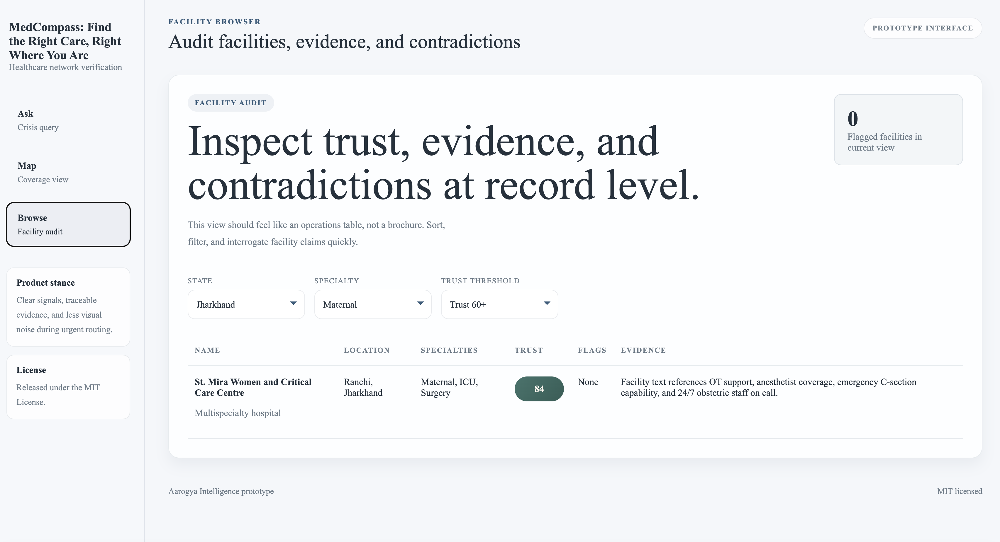

# MedCompass — System Design Document

---

## Summary

### App

[Link to Vercel](https://project-n4kab.vercel.app/)

**Note:** Real-time speech to query feature is disabled on Vercel deployment because of deployment bundle size limit. The demo uses sample data from our Agentic AI layer and database. 

### Tech Stack

Next.js, FastAPI, Neo4j, Supabase, Vercel

### Demo Video

[Watch the Demo Video](assets/demo-video.mp4)

<table>
  <tr>
    <td></td>
    <td></td>
    <td></td>
  </tr>
</table>

### Local Development

Backend:
```
cd backend
uv init
uv venv
source .venv/bin/activate
uvicorn app.main:app --reload   
```

Frontend:
```
cd frontend
npm i
npm run build
npm run dev
```

---

## 1. Product Overview

### Problem Statement

In India, a postal code determines a lifespan. 70% of the population lives in rural areas where healthcare discovery is broken — not because facilities don't exist, but because no one can verify what those facilities actually offer. A hospital can claim ICU capability on paper while having zero doctors and no ventilators.

### What We're Building

A three-layer intelligence system that transforms a static list of 10,000 unverified facility records into a living, queryable, trustworthy healthcare network — capable of answering the question _"where can I find verified cardiac care near Patna right now"_ in under 5 seconds, in any Indian language.

### Who Uses It

| User               | Need                                           | How System Serves Them                      |
| ------------------ | ---------------------------------------------- | ------------------------------------------- |
| Ambulance driver   | Nearest verified facility for active emergency | Crisis Query with voice input               |
| ASHA worker        | Find maternal care in her district             | Voice query in Hindi/regional language      |
| NGO health planner | Where to build next dialysis center            | Desert Map with district-level gap analysis |
| Government auditor | Which facilities are lying about capabilities  | Facility browser with contradiction flags   |

### User Personas and Identity Layer

The table above defines product personas, but the system also needs an explicit application user model for authentication, personalization, and access control.

**Supabase will handle the user layer**, while **Databricks remains the source of truth for healthcare intelligence data**.

**Application personas**

| Persona            | Auth Requirement | Supabase Stores                                     | Access Pattern                                  |
| ------------------ | ---------------- | --------------------------------------------------- | ----------------------------------------------- |
| Public user        | Optional         | session, preferred language, recent queries         | Crisis search, voice search, read-only results  |
| ASHA worker        | Yes              | profile, district, language, saved facilities       | Personalized local search and saved references  |
| NGO planner        | Yes              | organization, saved map views, exported reports     | Desert map, district reports, planning history  |
| Government auditor | Yes              | role, assigned region, review notes, audit history  | Facility browser, flags review, trace access    |
| Admin              | Yes              | role, org metadata, moderation and access settings  | User management, role assignment, QA operations |

**Supabase responsibilities**

- Auth: email OTP, magic link, phone OTP, or OAuth for app login
- Profiles: `user_profiles` table with name, role, organization, language, district, state
- Session state: active session, device metadata, last login, onboarding status
- User data: saved searches, saved facilities, bookmarks, report exports
- Collaboration data: feedback, facility correction submissions, audit notes
- Authorization: Row Level Security for persona-specific access

**Not stored in Supabase**

- Core facility records
- Trust scores and contradiction outputs
- Embeddings and vector search index
- Desert map aggregates

Those stay in Databricks because they are the analytical system of record.

---

## 2. System Architecture

```
┌─────────────────────────────────────────────────────────────────┐
│                        CLIENT LAYER                             │
│   Next.js 14 (Vercel) — Three screens + Voice interface         │
└────────────────────────────┬────────────────────────────────────┘
                             │ HTTPS
┌────────────────────────────▼────────────────────────────────────┐
│                        API LAYER                                │
│              FastAPI (Railway) — REST endpoints                 │
└──────┬──────────────────┬───────────────────┬───────────────────┘
       │                  │                   │
┌──────▼──────┐  ┌────────▼────────┐  ┌──────▼──────────────────┐
│  AGENT      │  │   DATA LAYER    │  │   VOICE LAYER           │
│  LAYER      │  │                 │  │                         │
│  LangGraph  │  │  Databricks     │  │  Whisper (STT)          │
│  + DSPy     │  │  Delta Tables   │  │  GPT-4o Realtime        │
│  + MLflow   │  │  Knowledge Graph│  │                         │
└──────┬──────┘  └─────────────────┘  └─────────────────────────┘
       │
┌──────▼──────────────────────────────────────────────────────────┐
│                    EXTERNAL SERVICES                            │
│  OpenAI GPT-4o │ Tavily Search/Extract/Research │ fasttext     │
└─────────────────────────────────────────────────────────────────┘
```

---

## 3. Data Architecture

### 3.1 Source Data

10,000 Indian medical facility records in Excel format containing 40 columns across four categories:

- **Identity:** name, phone, email, website, social links
- **Location:** address lines, city, state, PIN, lat/long
- **Clinical:** description, specialties, procedures, equipment, capabilities
- **Signals:** doctor count, capacity, social presence, logo, staff affiliation

### 3.2 Delta Table Schema

**Table 1: `facilities_raw`**
Direct ingest from Excel. No transformations. Source of truth.

**Table 2: `facilities_clean`**

```
name                          STRING
description                   STRING       -- original
description_en                STRING       -- translated if non-English
description_lang              STRING       -- detected language code
full_text                     STRING       -- concat of all text fields
specialties_clean             ARRAY<STRING>
equipment_clean               ARRAY<STRING>
capability_clean              ARRAY<STRING>
procedure_clean               ARRAY<STRING>
address_city                  STRING
address_stateOrRegion         STRING
address_zipOrPostcode         STRING
latitude                      DOUBLE
longitude                     DOUBLE
numberDoctors                 DOUBLE
capacity                      DOUBLE
facilityTypeId                STRING
officialPhone                 STRING
officialWebsite               STRING
distinct_social_media_count   INTEGER
custom_logo_presence          BOOLEAN
affiliated_staff_presence     BOOLEAN
number_of_facts               INTEGER
engagement_n_followers        INTEGER
```

**Table 3: `facilities_scored`**
Everything from `facilities_clean` plus:

```
trust_score                   INTEGER      -- 0 to 100
verified_capabilities         STRING       -- JSON array
contradiction_flags           STRING       -- JSON array
evidence_sentences            STRING       -- JSON array
completeness_score            DOUBLE
legitimacy_score              DOUBLE
tavily_verified               BOOLEAN      -- cross-checked via web
tavily_last_checked           TIMESTAMP
tavily_news_snippet           STRING
```

**Table 4: `desert_map`**

```
state                         STRING
city                          STRING
pincode                       STRING
centroid_lat                  DOUBLE
centroid_lng                  DOUBLE
total_facilities              INTEGER
avg_trust_score               DOUBLE
verified_cardiac              INTEGER
verified_dialysis             INTEGER
verified_neonatal             INTEGER
verified_oncology             INTEGER
verified_trauma               INTEGER
verified_surgery              INTEGER
verified_obstetric            INTEGER
desert_score                  INTEGER      -- 0 to 100, higher = worse
coverage_status               STRING       -- critical/high_risk/moderate/covered
flagged_facilities            INTEGER
```

### 3.3 Databricks Query Map

Every point in the system where Databricks is queried:

| When  | Query Type         | Table             | Purpose                      |
| ----- | ------------------ | ----------------- | ---------------------------- |
| Setup | DDL                | facilities_raw    | Ingest Excel                 |
| Setup | SQL Transform      | facilities_clean  | Normalize, parse arrays      |
| Setup | PySpark UDF        | facilities_clean  | Language detection           |
| Setup | PySpark + OpenAI   | facilities_clean  | Batch translation            |
| Setup | PySpark + OpenAI   | embeddings        | Generate + index vectors     |
| Batch | SQL SELECT         | facilities_clean  | Feed Trust Scorer            |
| Batch | SQL INSERT         | facilities_scored | Write scores back            |
| Batch | SQL GROUP BY       | desert_map        | Desert aggregation           |
| Live  | Vector Search API  | facilities_scored | Semantic retrieval per query |
| Live  | SQL SELECT by ID   | facilities_scored | Facility detail card         |
| Live  | SQL SELECT         | desert_map        | Map view data                |
| Live  | SQL SELECT + WHERE | facilities_scored | Filtered browse              |

---

## 4. Preprocessing Pipeline

Runs once before any live traffic. All steps are Databricks notebooks.

```
[Excel File]
     ↓
[Notebook 1: Ingest]
  - Read Excel → Delta table facilities_raw
  - Verify row count = 10,000

[Notebook 2: Clean]
  - Parse stringified arrays → proper lists
  - Build full_text concatenation
  - Fill nulls, cast numeric types
  - Write → facilities_clean

[Notebook 3: Language]
  - fasttext language detection on description
  - Flag non-English rows
  - Batch translate via GPT-4o-mini
  - Write description_en → facilities_clean

[Notebook 4: Embed]
  - OpenAI text-embedding-3-small on full_text
  - Push vectors → Mosaic AI Vector Search index
  - Index includes metadata filters:
    state, city, trust_score, facilityTypeId

[Notebook 5: Score]
  - Rule-based Trust Scorer (DSPy) on all 10k rows
  - Contradiction Detector pass
  - Tavily Extract on facilities with officialWebsite
  - Write → facilities_scored

[Notebook 6: Desert]
  - SQL aggregation on facilities_scored
  - Group by state/city/pincode
  - Compute desert_score per district
  - Write → desert_map
```

---

## 5. Trust Scorer Design

### 5.1 Philosophy

Since there is no ground truth, the scorer reasons from three independent signal sources and triangulates. A facility needs to pass at least two of three to score above 70.

```
Signal 1: Internal Consistency
  Does description text support specialty claims?

Signal 2: Structural Completeness
  Are the fields that should exist for this type of facility present?

Signal 3: External Legitimacy
  Does the web (via Tavily) confirm this facility exists and operates?
```

### 5.2 Scoring Rubric

```
BASE SCORE: 50

COMPLETENESS (+/-)
  Description > 100 chars          +10
  Description = 0 chars            -15
  Doctor count present and > 0     +10
  Phone number present             +5
  Lat/long present                 +5
  Year established present         +3

SPECIALTY VERIFICATION (+/-)
  Specialty claimed + evidence found in text    +8 per specialty
  Specialty claimed + no evidence              -10 per specialty
  High-acuity specialty + zero doctors         -10 additional

LEGITIMACY SIGNALS (+)
  2+ social media platforms         +8
  Custom logo present               +5
  Affiliated staff listed           +7
  5+ facts about organization       +5
  Tavily web confirmation           +10

CONTRADICTION FLAGS (-)
  Surgery claimed, no anesthesia mention, zero doctors    -15
  ICU claimed, no ventilator/critical care mention        -10
  24/7 claimed, zero doctors                              -10
  Multispecialty claimed, only 1 specialty listed         -5

FLOOR/CEILING: clamped 0–100
```

### 5.3 Contradiction Rules

```python
CONTRADICTION_RULES = [
  {
    "condition": "generalSurgery in specialties AND
                  'anesthes' not in all_text AND
                  doctors == 0",
    "flag": "Claims surgery with no anesthesia evidence and zero doctors",
    "penalty": -15
  },
  {
    "condition": "intensiveCare in specialties AND
                  none of ['ventilat','icu','critical'] in all_text",
    "flag": "Claims ICU but no supporting clinical detail",
    "penalty": -10
  },
  {
    "condition": "neonatal in specialties AND
                  none of ['nicu','incubat','newborn'] in all_text",
    "flag": "Claims neonatal care with no NICU evidence",
    "penalty": -10
  },
  {
    "condition": "oncology in specialties AND
                  none of ['cancer','chemo','oncol','radiat'] in all_text",
    "flag": "Claims oncology with no cancer treatment evidence",
    "penalty": -10
  },
  {
    "condition": "len(specialties) > 5 AND doctors == 0",
    "flag": "Multispecialty facility claims with zero doctors",
    "penalty": -8
  }
]
```

---

## 6. Agentic Pipeline (LangGraph)

### 6.1 Node Map

```
[Input: text or voice]
        ↓
┌───────────────────┐
│ LanguageDetector  │  fasttext → detect language
│                   │  if non-English → GPT-4o-mini translate
└────────┬──────────┘
         ↓
┌───────────────────┐
│ QueryParser       │  GPT-4o extracts:
│                   │  - specialty needed
│                   │  - location (city/state/district)
│                   │  - urgency level (emergency/routine)
│                   │  - radius preference
└────────┬──────────┘
         ↓
┌───────────────────┐
│ DatabricksRetriever│ Mosaic AI Vector Search
│                   │  - semantic search on full_text
│                   │  - metadata filter: state, trust_score > 40
│                   │  - returns top 25 candidates
└────────┬──────────┘
         ↓
┌───────────────────┐
│ GeographicFilter  │  Haversine distance filter
│                   │  drops results outside radius
│                   │  default radius: 60km emergency
│                   │                  100km routine
└────────┬──────────┘
         ↓
┌───────────────────┐
│ TrustFilter       │  reads trust_score from facilities_scored
│                   │  drops score < 50
│                   │  surfaces contradiction_flags
└────────┬──────────┘
         ↓
┌───────────────────┐
│ CapabilityVerifier│  DSPy ChainOfThought
│                   │  re-verifies each remaining facility
│                   │  against specific query requirements
│                   │  + Tavily Extract on any facility websites
└────────┬──────────┘
         │
         │ if confidence < 0.6 for all candidates
         │ ←─────────────────────────────────────┐
         │                                        │
         ↓                                        │
┌───────────────────┐                    expand radius + retry
│ ContradictionCheck│  flags any last-mile issues
│                   │  downgrades facilities with open flags
└────────┬──────────┘
         ↓
┌───────────────────┐
│ DesertEscalator   │  if results < 3:
│                   │  - query desert_map for this district
│                   │  - Tavily Search advanced for new facilities
│                   │  - fire desert alert to response
└────────┬──────────┘
         ↓
┌───────────────────┐
│ TavilyEnricher    │  Tavily Search basic/news on top 3
│                   │  checks: open? recent news? closures?
│                   │  Tavily Research pro for NGO mode
└────────┬──────────┘
         ↓
┌───────────────────┐
│ ResponseComposer  │  builds structured response:
│                   │  ranked facilities + scores + evidence
│                   │  + desert alerts + citations
└────────┬──────────┘
         ↓
┌───────────────────┐
│ TranslationLayer  │  if original query was non-English
│                   │  GPT-4o-mini translates response back
└────────┬──────────┘
         ↓
┌───────────────────┐
│ TTSConverter      │  if voice mode:
│                   │  OpenAI TTS nova voice
│                   │  streams audio back
└────────┬──────────┘
         ↓
┌───────────────────┐
│ MLflowLogger      │  logs every node's I/O
│                   │  trace_id returned with response
└───────────────────┘
```

### 6.2 Self-Correction Logic

```python
# In CapabilityVerifier node
if all(candidate['confidence'] < 0.6 for candidate in shortlist):
    if current_radius < 200:
        # Expand radius and go back to retriever
        return GraphState(
            action="retry",
            radius=current_radius * 1.5,
            relax_trust_threshold=True
        )
    else:
        # No good results anywhere — escalate to desert
        return GraphState(action="desert_escalate")
```

---

## 7. Tavily Integration Map

Every point where Tavily is used, which mode, and why:

| Node                | Tavily Mode | Depth      | Topic   | Purpose                                    |
| ------------------- | ----------- | ---------- | ------- | ------------------------------------------ |
| CapabilityVerifier  | Extract     | basic      | —       | Pull actual content from facility websites |
| TavilyEnricher      | Search      | basic      | general | Is facility still operational?             |
| TavilyEnricher      | Search      | basic      | news    | Any closure/scandal/upgrade news?          |
| DesertEscalator     | Search      | advanced   | general | Find unlisted facilities in desert zone    |
| DesertEscalator     | Search      | advanced   | news    | Recent healthcare investments in district  |
| Desert Report (NGO) | Research    | pro model  | —       | Full district health gap analysis          |
| Voice queries       | Search      | ultra-fast | —       | Sub-second results for voice latency       |
| Batch preprocessing | Extract     | advanced   | —       | Cross-check all facilities with websites   |

---

## 8. Voice Architecture

```
[User taps mic]
      ↓
[Browser MediaRecorder API]
      ↓ audio blob
[POST /api/voice/transcribe]
      ↓
[OpenAI Whisper API]
  - Handles Hindi, Tamil, Bengali,
    Telugu, Marathi, Gujarati natively
      ↓
[Detected language + transcript]
      ↓
[Same LangGraph pipeline]
      ↓
[Response text in user's language]
      ↓
[POST /api/voice/speak]
      ↓
[OpenAI TTS — nova voice]
  - Streams audio back
      ↓
[Browser plays audio]
[Relevant result card highlights in sync]
```

For stretch goal: replace STT+TTS with **GPT-4o Realtime API** via WebSocket — single round trip, lower latency, more natural conversation.

---

## 9. Backend API Design

**Base URL:** `https://api.aarogya.health`

### Query Endpoints

```
POST /api/query/crisis
  Body: { query, user_location, language: "auto" }
  Returns: ranked facilities + trust scores + evidence + trace_id

GET  /api/query/trace/{trace_id}
  Returns: full MLflow step-by-step agent trace
```

### Map Endpoints

```
GET  /api/map/deserts
  Params: ?specialty=cardiac&min_trust=60&state=Bihar
  Returns: all districts with desert scores + coordinates

GET  /api/map/facility/{id}
  Returns: full intelligence card for one facility
```

### Browse Endpoints

```
GET  /api/facilities
  Params: ?state=&specialty=&min_trust=&page=&limit=
  Returns: paginated facility list with scores

GET  /api/facilities/{id}
  Returns: complete facility record with full trust breakdown
```

### Voice Endpoints

```
POST /api/voice/transcribe
  Body: audio blob (multipart)
  Returns: { transcript, detected_language, confidence }

POST /api/voice/speak
  Body: { text, language }
  Returns: audio stream
```

### Report Endpoints

```
GET  /api/report/district/{pincode}
  Returns: Tavily Research pro report for NGO planners
  (streams response via SSE)
```

---

## 10. Frontend Design

### Screen 1: Crisis Query (Landing Page)

- Full-width search bar with voice button
- Auto-detects input language
- Quick filter chips: ICU / Blood Bank / Dialysis / Trauma / Neonatal / Cardiac
- Results as cards: trust score badge (color-coded) + verified capabilities + evidence sentence inline
- Expandable card: full trust breakdown + contradiction flags + agent reasoning trace
- Desert alert banner if results are sparse
- Map pin sidebar showing result locations

### Screen 2: Desert Map

- Full India map (Mapbox GL)
- Toggle by specialty — recolors districts instantly
- Color scale: green (covered) → yellow → orange → red (critical desert)
- Click district → popup with coverage breakdown + nearest verified alternative
- Side panel: ranked worst 10 deserts for selected specialty
- Export button for NGO planners → triggers Tavily Research report

### Screen 3: Facility Browser

- Searchable, filterable table of all 10,000 facilities
- Columns: name, state, trust score badge, specialties count, flags count
- Click row → full intelligence card
- Filters: state, specialty, min trust score, has flags toggle

---

## 11. Project File Structure

```
aarogya/
├── databricks/
│   ├── 01_ingest.ipynb
│   ├── 02_clean.ipynb
│   ├── 03_language.ipynb
│   ├── 04_embed.ipynb
│   ├── 05_score.ipynb
│   └── 06_desert.ipynb
│
├── backend/
│   ├── main.py
│   ├── routers/
│   │   ├── query.py
│   │   ├── map.py
│   │   ├── facilities.py
│   │   ├── voice.py
│   │   └── report.py
│   ├── agent/
│   │   ├── graph.py
│   │   └── nodes/
│   │       ├── language_detector.py
│   │       ├── query_parser.py
│   │       ├── databricks_retriever.py
│   │       ├── geographic_filter.py
│   │       ├── trust_filter.py
│   │       ├── capability_verifier.py
│   │       ├── contradiction_check.py
│   │       ├── desert_escalator.py
│   │       ├── tavily_enricher.py
│   │       ├── response_composer.py
│   │       ├── translation_layer.py
│   │       └── tts_converter.py
│   ├── scorer/
│   │   ├── trust_scorer.py
│   │   └── contradiction.py
│   ├── db/
│   │   ├── databricks.py
│   │   └── vector_search.py
│   └── services/
│       ├── translation.py
│       ├── voice.py
│       ├── tavily_service.py
│       └── mlflow_tracer.py
│
└── frontend/
    ├── app/
    │   ├── page.tsx              ← Crisis Query
    │   ├── map/page.tsx          ← Desert Map
    │   └── browse/page.tsx       ← Facility Browser
    ├── components/
    │   ├── SearchBar.tsx
    │   ├── VoiceButton.tsx
    │   ├── FacilityCard.tsx
    │   ├── TrustBadge.tsx
    │   ├── DesertMap.tsx
    │   ├── AgentTrace.tsx
    │   └── DesertAlert.tsx
    └── lib/
        ├── api.ts
        └── tavily.ts             ← @tavily/ai-sdk for Vercel AI SDK v5
```

---

## 12. Complete Tech Stack

| Layer               | Technology                                | Purpose                                  |
| ------------------- | ----------------------------------------- | ---------------------------------------- |
| Data storage        | Databricks Delta Lake                     | All facility data, scores, desert map    |
| User auth & app data| Supabase                                 | Auth, profiles, saved searches, feedback |
| Data processing     | PySpark                                   | Cleaning, normalization, aggregation     |
| Vector search       | Mosaic AI Vector Search                   | Semantic facility retrieval              |
| Embeddings          | OpenAI text-embedding-3-small             | Facility full_text vectors               |
| Trust scoring       | DSPy + GPT-4o-mini                        | Batch + live capability verification     |
| Agent orchestration | LangGraph                                 | End-to-end query pipeline                |
| LLM reasoning       | GPT-4o                                    | Query parsing, agent reasoning           |
| LLM utility         | GPT-4o-mini                               | Scoring, translation, TTS prep           |
| Web search          | Tavily Search (basic/advanced/ultra-fast) | Facility verification, desert enrichment |
| Content extraction  | Tavily Extract                            | Facility website cross-check             |
| Research            | Tavily Research pro                       | NGO district gap reports                 |
| Observability       | MLflow 3                                  | Full agent trace per query               |
| Language detection  | fasttext                                  | Per-record and per-query                 |
| Translation         | GPT-4o-mini                               | Non-English records and responses        |
| Speech to text      | OpenAI Whisper                            | Voice input                              |
| Text to speech      | OpenAI TTS nova                           | Voice output                             |
| Realtime voice      | GPT-4o Realtime API                       | Stretch: full voice conversation         |
| Frontend            | Next.js 14 + Tailwind + Shadcn/ui         | All three screens                        |
| Maps                | Mapbox GL                                 | Desert map, facility pins                |
| Frontend deploy     | Vercel + @tavily/ai-sdk                   | Production frontend                      |
| Backend             | FastAPI + Python                          | All API endpoints                        |
| Backend deploy      | Railway                                   | Long-running Python processes            |

---

## 13. What Judges See in the Demo

Three minutes. One story.

**Minute 1 — The Problem**
Open the Desert Map. Filter by Cardiac. Three states light up red. Click Palamu district, Jharkhand — zero verified cardiac facilities within 112km. This is real data, not a mock.

**Minute 2 — The Solution**
Type: _"Emergency C-section near Ranchi"_. Watch the agent trace panel on the right — judges see every reasoning step live. Two verified results appear with evidence sentences highlighted from the raw facility text. A desert alert fires for the three surrounding districts.

**Minute 3 — The Differentiator**
Hand the phone to a judge. Say: _"Speak in any Indian language."_ They speak Hindi. Whisper transcribes. LangGraph runs. TTS responds in Hindi with a verified hospital name, distance, and phone number. No typing. No reading. Just voice.

This is the design doc, I want to get started with the frontend, tell me where to stat
